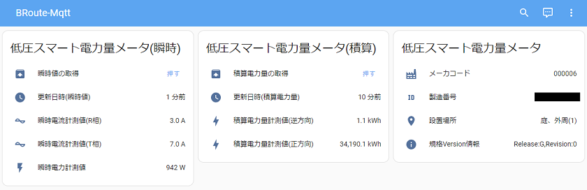
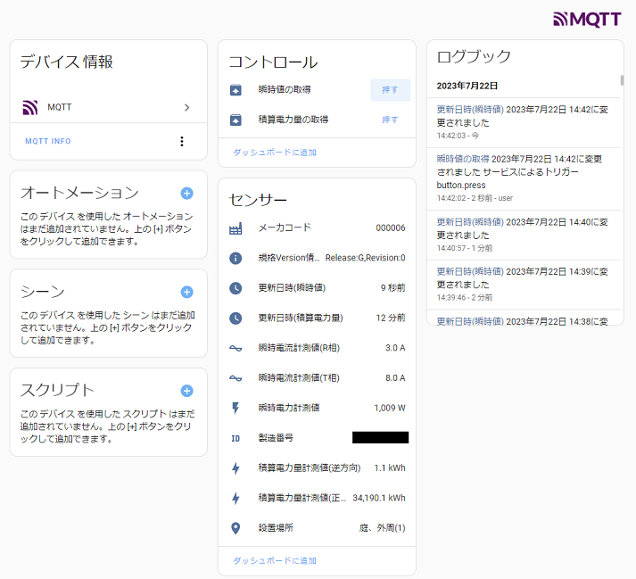

# ホームアシスタント アドオン BRoute-Mqtt
低圧スマート電力量メータをHoma AssistantのMQTT統合にデバイス/センサーとして統合するアドオン

ECHONET Liteプロトコル(Bルート)を経由して情報を取得する為、 
HA-OSの搭載された機器に接続可能な、Wi-SUN USBスティックが必要です

## 機能概要
* 次の情報を取得し、MQTT統合のデバイス/センサー情報として通知します([MQTT Sensor - Home Assistant](https://www.home-assistant.io/integrations/sensor.mqtt/))
  * 起動時/手動での要求時/指定周期の取得
    * 瞬時電流計測値(R相) A(アンペア)
    * 瞬時電流計測値(T相) A(アンペア)
    * 瞬時電力計測値 W(ワット)
  * 起動時/手動での要求時/30分毎の定期通知の受信
    * 積算電力量計測値(逆方向) kWh
    * 積算電力量計測値(正方向) kWh
  * 起動時(定性情報)
    * メーカコード
    * 規格Version情報
    * 製造番号
    * 設置場所
* 積算電力量、瞬時値それぞれを即時取得するボタンを提供します([MQTT Button - Home Assistant](https://www.home-assistant.io/integrations/button.mqtt/))

## 前提条件
* スカイリー・ネットワークス SKSTACK-IP(Single-hop Edition) に対応した動作をする実装となっています
    * 「テセラ・テクノロジー [RL7023 Stick-D/IPS](https://www.tessera.co.jp/product/rfmodul/rl7023stick-d_ips.html)」にて動作を確認しています。
        * 「JORJIN WSR35A1-00」や「ROHM [BP35A1](https://www.rohm.co.jp/products/wireless-communication/specified-low-power-radio-modules/bp35a1-product)」と互換があるハズです。
   * 「Wi-SUN Bルート / HAN」※1 対応のものや、「Wi-SUN Bルート /
Enhanced HAN」※2 対応のものは コマンドの引数や使い方が異なる可能性があります。
      * ※1 「ラトックシステム [RS-WSUHA-P](https://www.ratocsystems.com/products/wisun/usb-wisun/rs-wsuha/)」,「テセラ・テクノロジー [RL7023 Stick-D/DSS](https://www.tessera.co.jp/product/rfmodul/rl7023stick-d_dss.html)」や「ROHM [BP35C0](https://www.rohm.co.jp/products/wireless-communication/specified-low-power-radio-modules/bp35c0-product)」,「ROHM BP35C2」
      * ※2 「ラトックシステム [RS-WSUHA-J11](https://www.ratocsystems.com/products/wisun/usb-wisun/rs-wsuha/)」,「ROHM [BP35C1-J11](https://www.rohm.co.jp/products/wireless-communication/specified-low-power-radio-modules/bp35c0-j11-product)、[BP35C2-J11-T01](https://www.rohm.co.jp/products/wireless-communication/specified-low-power-radio-modules/bp35c0-j11-product)」
      * 内部ライブラリ`SkstackIpDotNet`,`EchoDotNetLiteSkstackIpBridge`の実装を少し修正すればいけるはず
   * その他参考情報
       * [Wi-SUNモジュール - Wi-SUNモジュール製品一覧 | ローム株式会社 - ROHM Semiconductor](https://www.rohm.co.jp/products/wireless-communication/specified-low-power-radio-modules#anc-01)
       * [ローム Wi-SUN対応無線モジュール｜チップワンストップ - 電子部品・半導体の通販サイト](https://www.chip1stop.com/sp/products/rohm_wi-sun-module)
       * [Bルートやってみた - Skyley Official Wiki](https://www.skyley.com/wiki/index.php?B%E3%83%AB%E3%83%BC%E3%83%88%E3%82%84%E3%81%A3%E3%81%A6%E3%81%BF%E3%81%9F)

## 導入方法

3種類の方法があります

1. GitHub ContainerRegistoryに登録されたDockerイメージを参照する
    1. 
        1. ホーム アシスタント UI でアドオン ストアに移動します (左側のメニューで[スーパーバイザー]、上部タブで[アドオン ストア] )
        1. 右上隅にある 3 つの縦のドットを選択し、リポジトリを選択します
        1. 「アドオン リポジトリの管理」画面で、`https://github.com/hsakoh/ha-addon` を入力し、「追加」をクリックします。
        1. リポジトリを追加した後、アドオンのリストの一番下までスクロールするか、検索を使用してアドオンを見つけます
    1. アドオンを選択し、「インストール」をクリックします
1. 事前に.NETアプリをコンパイルと発行したうえで、HAOS上でDockerイメージをビルドする
    1. リポジトリのルートで`./_compile_self/dotnet_publish.ps1`を実行してください。
    1. `_compile_self`フォルダの中身一式を HA-OSの`/addons/broute-mqtt`に配置します
1. HA-OS上でDockerイメージをビルドする際に、.NETアプリもコンパイルして発行する
    1. `src`フォルダ と `_build_on_haos`フォルダの中身一式を HA-OSの`/addons/broute-mqtt`に配置します
    1. HA-OS搭載のマシンが非力な場合、ビルド(インストール)に非常に時間がかかります。 その間HA-OSが停止しているように見える場合があります。(RasPi3B+で30分等)**推奨しません。**

## 設定項目
|設定キー|既定値|説明|
|--|--|--|
|BRoute:Id|-|配送電会社から提供される Bルートの認証IDを指定します 通常は32文字の英数字です|
|BRoute:Pw|-|Bルートの認証パスワードを指定します 通常は12文字の英数字です|
|BRoute:SerialPort|`/dev/ttyUSB0`|HAOSで識別される Wi-SUN USBスティックのシリアルポートを指定します|
|BRoute:ForcePANScan|`false`|PANスキャンを起動時に強制する場合、`true`を指定します `false`の場合、過去の接続時のPANを参照する為、再起動時等で再接続が早くなります|
|BRoute:PanDescSavePath|`/data/EPANDESC.json`|PANの情報を保存する先を指定します|
|BRoute:InstantaneousValueInterval|`00:01:10`|瞬時値の周期的な取得間隔を指定します TimeSpan(`HH:mm:ss`)形式で記述します|
|BRoute:PanScanMaxRetryAttempts|`3`|PANスキャンの最大再試行回数を指定します|
|BRoute:PanScanRetryDelay|`00:01:00`|PANスキャンの再試行間隔を指定します TimeSpan(`HH:mm:ss`)形式で記述します|
|BRoute:PanaConnectTimeout|`00:00:30`|PANA接続のタイムアウトを指定します TimeSpan(`HH:mm:ss`)形式で記述します|
|BRoute:PanaConnectMaxRetryAttempts|`3`|PANA接続の最大再試行回数を指定します|
|BRoute:PanaConnectRetryDelay|`00:01:00`|PANA接続の再試行間隔を指定します TimeSpan(`HH:mm:ss`)形式で記述します|
|BRoute:PropertyReadTimeout|`00:00:05`|プロパティ値読み出しのタイムアウトを指定します TimeSpan(`HH:mm:ss`)形式で記述します|
|BRoute:PropertyReadMaxRetryAttempts|`3`|プロパティ値読み出しの最大再試行回数を指定します|
|BRoute:PropertyReadRetryDelay|`00:00:05`|プロパティ値読み出しの再試行間隔を指定します TimeSpan(`HH:mm:ss`)形式で記述します|
|BRoute:ContinuePollingOnError|`true`|ポーリングでタイムアウト等エラー発生時、アドオンの処理を継続する場合、`true`を指定します|
|Mqtt:AutoConfig|true|デフォルトのHome Assistant Mosquitto統合を使用しているアドオンユーザーは、Home Assistant Supervisor APIを介して接続の詳細を検出できるため、この値をTrueに設定できます。|
|Mqtt:Host|-|MQTTブローカー ホスト名を指定します|
|Mqtt:Port|`1883`|ポート番号を指定します|
|Mqtt:Id|-|認証がある場合、IDを指定します|
|Mqtt:Pw|-|認証がある場合、PWを指定します|
|Mqtt:Tls|`false`|TLS接続を受け入れる場合、指定します|
|LogLevel|`Trace`|ログレベルを設定します `Trace`,`Debug`,`Information`,`Warning`,`Error`,`Critical`,`None`|

## 開発者(&アドオン外での実行)向けの情報
* アドオンとしては、Home Assistantベースイメージに .NETランタイムを導入し、 `.NET のコンソールアプリケーションを起動しているだけです。
* アプリケーション単体はWindows上でも実行可能です。
   * シリアルポートに`COM3`等を設定してください。
   * slnファイルをVisualStudioで開き、デバッグ可能です。
   * Windows上では、AddOnの構成ファイル`/data/options.json`にアクセスできないと思われるので、 `appsettings.Development.json`に構成を行ってください。
   * 発行時は、ridで`win-x64`等を指定してください。  [.NET Runtime Identifier (RID) カタログ | Microsoft Learn](https://learn.microsoft.com/ja-jp/dotnet/core/rid-catalog)
* [.NET での汎用ホスト 既定の builder 設定](https://learn.microsoft.com/ja-jp/dotnet/core/extensions/generic-host#default-builder-settings)の通り、 環境変数やコマンドライン引数からも読み込み可能です (階層は`BRoute:Id`等コロンを含めて表現が必要です)
* Wi-SUN USBスティックとのやり取りは、[NuGet Gallery | System.IO.Ports 8.0.0](https://www.nuget.org/packages/System.IO.Ports/8.0.0)を使用しています。
   * Linux等向けは動作環境毎の発行が必要となる場合があります。(`linux-arm64`と`linux-musl-arm64`の違いとか)
   * 参考：[System.IO.Ports.SerialPort not working on Linux arm64 · Issue #74332 · dotnet/runtime](https://github.com/dotnet/runtime/issues/74332)