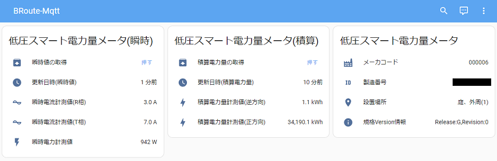
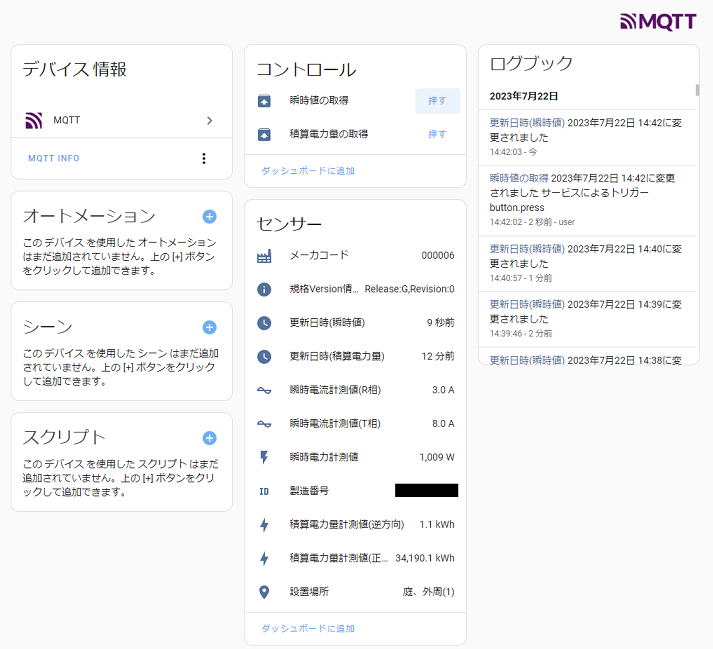

# ホームアシスタント アドオン BRoute-Mqtt
低圧スマート電力量メータをHome AssistantのMQTT統合にデバイス/センサーとして統合するアドオン

ECHONET Liteプロトコル(Bルート)を経由して情報を取得する為、<br>
HA-OSの搭載された機器に接続可能な、Wi-SUN USBスティックが必要です



## 機能概要
* 次の情報を取得し、MQTT統合のデバイス/センサー情報として通知します([MQTT Sensor - Home Assistant](https://www.home-assistant.io/integrations/sensor.mqtt/))
  * 起動時/手動での要求時/指定周期の取得
    * 瞬時電流計測値(R相) A(アンペア)
    * 瞬時電流計測値(T相) A(アンペア)
    * 瞬時電力計測値 W(ワット)
  * 起動時/手動での要求時/30分毎の定期通知の受信
    * 積算電力量計測値(逆方向) kWh
    * 積算電力量計測値(正方向) kWh
  * 起動時/手動での要求時(第2世代スマートメーターのみ)
    * 1分積算電力量計測値(正方向/逆方向) kWh
  * 起動時(定性情報)
    * メーカコード
    * 規格Version情報
    * 製造番号
    * 設置場所
    * Bルート識別番号(第2世代スマートメーターのみ)
* 積算電力量、瞬時値、1分積算電力量(第2世代のみ)それぞれを即時取得するボタンを提供します([MQTT Button - Home Assistant](https://www.home-assistant.io/integrations/button.mqtt/))
* ECHONET Lite Appendix Release R(rev.4) のプロパティ定義に対応しています
  * 第2世代スマートメーター固有の項目(1分積算電力量・Bルート識別番号)は、メーターの Get プロパティマップに存在する場合のみエンティティが作成されます
* 1つの Wi-SUN ドングルで複数のメーターを巡回取得する「複数モード」に対応しています([動作モード](#動作モード)を参照)



## 動作モード

### 単体モード(従来動作)
`BRoute:Id`/`BRoute:Pw` を設定した場合の動作です。<br>
単一のメーターと常時 PANA セッションを維持し、瞬時値を周期取得しつつ、30分毎の定時積算電力量の通知(INF)を受信します。<br>
セッションが失われた場合(EVENT 0x26/0x29 等)は、次回ポーリング時に自動で再接続します。

### 複数モード(巡回ポーリング)
`BRoute:Id`/`BRoute:Pw` を空にして、`BRoute:Meters` に1件以上のメーターを設定した場合の動作です。<br>
Wi-SUN の Bルートは 1 ドングルにつき同時に 1 つの PANA セッションしか確立できないため、<br>
メーター毎に 接続→取得→切断(SKTERM) を繰り返して巡回します。

* `BRoute:Id`/`Pw` と `BRoute:Meters` の両方に値がある場合は、**単体モードとして動作**します(`Meters` は無視されます)
* 通知(INF)には依存せず、積算電力量は毎巡回で定時積算電力量(0xEA/0xEB : 30分毎の確定値)を読み出して更新します
* PAN スキャン結果はメーター毎に `EPANDESC.{BルートID下8桁}.json` として保存し、<br>2巡目以降は SKSCAN を省略して高速に切り替えます(キャッシュでの接続失敗時は自動で再スキャンします)
* 一度も接続できないまま PAN スキャンがリトライオーバーになったメーターは、圏外とみなして<br>**その起動中は巡回対象から除外**します(アドオンを再起動すると再試行します)
* 接続直後の初期化(プロパティマップ読み込み)がタイムアウトした場合は、<br>同一訪問内でセッションを張り直して一度だけ再試行します
* ボタン(瞬時値/積算電力量/1分積算電力量)の押下は、そのメーターへの**次回訪問時**に実行されます
* HA 上のデバイス/エンティティは、巡回でメーターが検出され次第、順次現れます
* 目安時間: 1メーターあたり約15〜20秒(初回訪問はプロパティマップ取得等で +20〜40秒)。<br>
  `InstantaneousValueInterval`(既定 `00:01:10`)は**巡回の開始間隔**として扱われ、1巡がこれを超える場合は連続で巡回します。<br>
  瞬時値の更新頻度が巡回周期に律速される為、実用上は2台程度までを推奨します

## broute-wifi-mqtt との同時稼働

同一メーターを [broute-wifi-mqtt](https://github.com/hsakoh/broute-wifi-mqtt)(Wi-Fi 方式)と本アドオンの両方から参照すると、<br>
MQTT Discovery の `unique_id` / `device.identifiers` が同一になるため、HA 上でエンティティを取り合い状態が不安定になります。<br>
`BRoute:AddWiSunSuffix: true` を設定すると、本アドオン側の識別子(トピック/unique_id/device.identifiers)に `_wisun` サフィックスが付与され、別デバイスとして安定して共存できます。

> [!NOTE]
> `AddWiSunSuffix` を後から `true` へ切り替えると、HA 上は**別エンティティとして新規作成**されます(履歴は引き継がれません)。<br>
> 旧エンティティが不要な場合は、retain された discovery config への空ペイロード送信、または HA 上での手動削除が必要です。

## 前提条件
* スカイリー・ネットワークス SKSTACK-IP(Single-hop Edition) に対応した動作をする実装となっています
    * 「テセラ・テクノロジー [RL7023 Stick-D/IPS](https://www.tessera.co.jp/product/rfmodul/rl7023stick-d_ips.html)」にて動作を確認しています。
        * 「JORJIN WSR35A1-00」や「ROHM [BP35A1](https://www.rohm.co.jp/products/wireless-communication/specified-low-power-radio-modules/bp35a1-product)」と互換があるハズです。
   * 「Wi-SUN Bルート / HAN」※1 対応のものや、「Wi-SUN Bルート /
Enhanced HAN」※2 対応のものは<br>コマンドの引数や使い方が異なる可能性があります。
      * ※1 「ラトックシステム [RS-WSUHA-P](https://www.ratocsystems.com/products/wisun/usb-wisun/rs-wsuha/)」,「テセラ・テクノロジー [RL7023 Stick-D/DSS](https://www.tessera.co.jp/product/rfmodul/rl7023stick-d_dss.html)」や「ROHM [BP35C0](https://www.rohm.co.jp/products/wireless-communication/specified-low-power-radio-modules/bp35c0-product)」,「ROHM BP35C2」
      * ※2 「ラトックシステム [RS-WSUHA-J11](https://www.ratocsystems.com/products/wisun/usb-wisun/rs-wsuha/)」,「ROHM [BP35C1-J11](https://www.rohm.co.jp/products/wireless-communication/specified-low-power-radio-modules/bp35c0-j11-product)、[BP35C2-J11-T01](https://www.rohm.co.jp/products/wireless-communication/specified-low-power-radio-modules/bp35c0-j11-product)」
   * その他参考情報
       * [Wi-SUNモジュール - Wi-SUNモジュール製品一覧 | ローム株式会社 - ROHM Semiconductor](https://www.rohm.co.jp/products/wireless-communication/specified-low-power-radio-modules#anc-01)
       * [ローム Wi-SUN対応無線モジュール｜チップワンストップ - 電子部品・半導体の通販サイト](https://www.chip1stop.com/sp/products/rohm_wi-sun-module)
       * [Bルートやってみた - Skyley Official Wiki](https://www.skyley.com/wiki/index.php?B%E3%83%AB%E3%83%BC%E3%83%88%E3%82%84%E3%81%A3%E3%81%A6%E3%81%BF%E3%81%9F)

> [!IMPORTANT]
> **BP35C2(RS-WSUHA-P 等)をご利用の場合は、事前に `WOPT 01` の設定が必要です**
>
> BP35C2は、初期設定ではデータ部の出力が**バイナリ形式**になっており、<br>
> `BRoute:UseBP35C0Commands: true` を指定しても、そのままでは正しく接続・通信できません。
>
> 事前にシリアルターミナル（Windowsなら[Tera Term](https://teratermproject.github.io/)等）で<br>
> ボーレート`115200`でモジュールに接続し、以下のコマンドを実行して<br>
> データ部の出力を**16進ASCII形式**に変更してください。
>
> ```
> ROPT       ← 現在の設定を確認 (例: OK 00 ならバイナリ形式)
> WOPT 01    ← 16進ASCII形式に変更 (OK が返る)
> ```
>
> この設定はモジュールの不揮発メモリに書き込まれる為、**初回のみ**実施すればOKです。
>
> 参考: [#6](https://github.com/hsakoh/broute-mqtt/issues/6) , [legnoh/smartmeter-exporter](https://github.com/legnoh/smartmeter-exporter)

## 導入方法

### 手順 1: Mosquitto MQTT ブローカーのインストール

本アドオンはスマートメーターの情報を Home Assistant の [MQTT 統合](https://www.home-assistant.io/integrations/mqtt/)へ送信します。  
まず MQTT ブローカーをインストールしてください。

推奨は [Mosquitto MQTT broker アドオン](https://github.com/home-assistant/addons/blob/master/mosquitto/DOCS.md) を使用する方法です。

### 手順 2: MQTT 統合の構成

[こちらのページ](https://www.home-assistant.io/integrations/mqtt/#broker-configuration) の手順に従い、MQTT 統合がどのブローカーと連携するかを設定してください。

### 手順 3: アドオンのインストール

アドオンのインストール方法は 3 種類あります。

#### 3-1. GitHub Container Registry に登録された Docker イメージを参照する（推奨）

[](https://my.home-assistant.io/redirect/supervisor_add_addon_repository/?repository_url=https%3A%2F%2Fgithub.com%2Fhsakoh%2Fha-addon)

上のボタンが機能しない場合は、以下の手順でリポジトリを追加してください。

1. ホームアシスタント UI でアドオンストアに移動します（左側のメニューで「スーパーバイザー」、上部タブで「アドオンストア」）
2. 右上隅にある 3 つの縦のドットを選択し、「リポジトリ」を選択します
3. 「アドオンリポジトリの管理」画面で `https://github.com/hsakoh/ha-addon` を入力し、「追加」をクリックします
4. リストの一番下までスクロールするか、検索を使用してアドオンを見つけます
5. アドオンを選択し、「インストール」をクリックします

#### 3-2. 事前に .NET アプリをコンパイル・発行してから HAOS 上で Docker イメージをビルドする

1. リポジトリのルートで `./_compile_self/dotnet_publish.ps1` を実行します
2. `_compile_self` フォルダの中身一式を HA-OS の `/addons/broute-mqtt` に配置します

#### 3-3. HA-OS 上で Docker イメージをビルドする際に .NET アプリもコンパイル・発行する

1. `src` フォルダと `_build_on_haos` フォルダの中身一式を HA-OS の `/addons/broute-mqtt` に配置します
2. HA-OS 搭載のマシンが非力な場合、ビルド（インストール）に非常に時間がかかります。その間 HA-OS が停止しているように見える場合があります（RasPi3B+ で 30 分等）。**推奨しません。**

## 設定項目
|設定キー|既定値|説明|
|--|--|--|
|BRoute:Id|-|配送電会社から提供される<br>Bルートの認証IDを指定します<br>通常は32文字の英数字です<br>設定すると単体モードで動作します|
|BRoute:Pw|-|Bルートの認証パスワードを指定します<br>通常は12文字の英数字です|
|BRoute:Meters|`[]`|複数モードで巡回するメーターの認証情報リストを指定します<br>`- Id: xxxx`<br>`  Pw: yyyy`<br>の配列で記述します<br>`BRoute:Id`/`Pw` が設定されている場合は無視されます(単体モード優先)|
|BRoute:SerialPort|`/dev/ttyUSB0`|HAOSで識別される<br>Wi-SUN USBスティックのシリアルポートを指定します|
|BRoute:UseBP35C0Commands |`false`|使用するコマンド体系を切り替えます。SKSTACK-IP(Single-hop Edition)(RL7023 Stick-D/IPS,ROHM BP35A1等)の場合、`False`<br>RL7023 Stick-D/DSS,RS-WSUHA-P、ROHM BP35C2等の場合、`true`(**実験的**)<br>※BP35C2(RS-WSUHA-P等)は事前に`WOPT 01`の設定が必要です。[前提条件](#前提条件)を参照してください|
|BRoute:ForcePANScan|`false`|PANスキャンを起動時に強制する場合、`true`を指定します<br>`false`の場合、過去の接続時のPANを参照する為、再起動時等で再接続が早くなります|
|BRoute:PanDescSavePath|`/data/EPANDESC.json`|PANの情報を保存する先を指定します|
|BRoute:InstantaneousValueInterval|`00:01:10`|瞬時値の周期的な取得間隔を指定します<br>複数モードでは巡回の開始間隔として扱われます<br>TimeSpan(`HH:mm:ss`)形式で記述します|
|BRoute:PanScanMaxRetryAttempts|`3`|PANスキャンの最大再試行回数を指定します|
|BRoute:PanScanRetryDelay|`00:01:00`|PANスキャンの再試行間隔を指定します<br>TimeSpan(`HH:mm:ss`)形式で記述します|
|BRoute:PanaConnectTimeout|`00:01:00`|PANA接続のタイムアウトを指定します<br>TimeSpan(`HH:mm:ss`)形式で記述します|
|BRoute:PanaConnectMaxRetryAttempts|`3`|PANA接続の最大再試行回数を指定します|
|BRoute:PanaConnectRetryDelay|`00:01:00`|PANA接続の再試行間隔を指定します<br>TimeSpan(`HH:mm:ss`)形式で記述します|
|BRoute:SkTermTimeout|`00:00:10`|複数モードでのセッション切断(SKTERM)の完了待ちタイムアウトを指定します<br>TimeSpan(`HH:mm:ss`)形式で記述します|
|BRoute:PropertyReadTimeout|`00:00:05`|プロパティ値読み出しのタイムアウトを指定します<br>TimeSpan(`HH:mm:ss`)形式で記述します|
|BRoute:PropertyReadMaxRetryAttempts|`3`|プロパティ値読み出しの最大再試行回数を指定します|
|BRoute:PropertyReadRetryDelay|`00:00:05`|プロパティ値読み出しの再試行間隔を指定します<br>TimeSpan(`HH:mm:ss`)形式で記述します|
|BRoute:PropertyReadIntervalDelay|`00:00:02`|プロパティ値読み出しの要求間ウェイト(メーター保護)を指定します<br>TimeSpan(`HH:mm:ss`)形式で記述します|
|BRoute:ContinuePollingOnError|`true`|ポーリングでタイムアウト等エラー発生時、アドオンの処理を継続する場合、`true`を指定します|
|BRoute:AddWiSunSuffix|`false`|broute-wifi-mqtt と同一メーターを同時参照する場合に、MQTT識別子へ `_wisun` サフィックスを付与します<br>[broute-wifi-mqtt との同時稼働](#broute-wifi-mqtt-との同時稼働)を参照してください|
|Mqtt:AutoConfig|true|デフォルトのHome Assistant Mosquitto統合を使用しているアドオンユーザーは、Home Assistant Supervisor APIを介して接続の詳細を検出できるため、この値をTrueに設定できます。|
|Mqtt:Host|-|MQTTブローカー<br>ホスト名を指定します|
|Mqtt:Port|`1883`|ポート番号を指定します|
|Mqtt:Id|-|認証がある場合、IDを指定します|
|Mqtt:Pw|-|認証がある場合、PWを指定します|
|Mqtt:Tls|`false`|TLS接続を受け入れる場合、指定します|
|LogLevel|`Trace`|ログレベルを設定します<br>`Trace`,`Debug`,`Information`,`Warning`,`Error`,`Critical`,`None`|

## 開発者(&アドオン外での実行)向けの情報
* アドオンとしては、Home Assistantベースイメージに .NETランタイムを導入し、<br>`.NET のコンソールアプリケーションを起動しているだけです。
* アプリケーション単体はWindows上でも実行可能です。
   * シリアルポートに`COM3`等を設定してください。
   * slnファイルをVisualStudioで開き、デバッグ可能です。
   * Windows上では、AddOnの構成ファイル`/data/options.json`にアクセスできないと思われるので、<br>`appsettings.Development.json`に構成を行ってください。
   * 発行時は、ridで`win-x64`等を指定してください。<br> [.NET Runtime Identifier (RID) カタログ | Microsoft Learn](https://learn.microsoft.com/ja-jp/dotnet/core/rid-catalog)
* [.NET での汎用ホスト 既定の builder 設定](https://learn.microsoft.com/ja-jp/dotnet/core/extensions/generic-host#default-builder-settings)の通り、<br>環境変数やコマンドライン引数からも読み込み可能です<br>(階層は`BRoute:Id`等コロンを含めて表現が必要です)
* Wi-SUN USBスティックとのやり取りは、[NuGet Gallery | System.IO.Ports 8.0.0](https://www.nuget.org/packages/System.IO.Ports/8.0.0)を使用しています。
   * Linux等向けは動作環境毎の発行が必要となる場合があります。(`linux-arm64`と`linux-musl-arm64`の違いとか)
   * 参考：[System.IO.Ports.SerialPort not working on Linux arm64 · Issue #74332 · dotnet/runtime](https://github.com/dotnet/runtime/issues/74332)